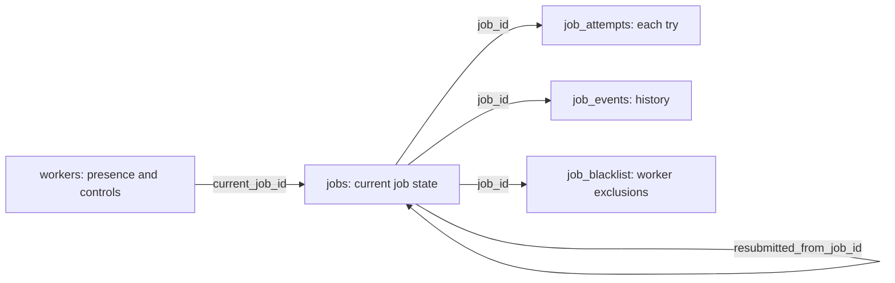

# Render farm database walkthrough

Reviewed September 10, 2026, from the dispatcher migrations, TypeScript SQL queries, and Python clients. This is a review of the repository's configured schema and behavior; the live production database was not queried or changed.

## Where the data lives

There is one configured production SQL database: **`defect-farm-production`**, a Cloudflare D1 database bound as **`DB`** to the **`defect-farm-api`** service. Its migrations define five application tables.

The render worker and farm manager call the dispatcher's HTTP API. The dispatcher executes SQL. The Python worker has no separate application SQL database in the source reviewed here.

| Storage | Responsibility |
| --- | --- |
| Cloud D1 database | Job state, ownership leases, worker status, retries, attempt history, events, blacklists |
| Dropbox / project and output folders | Job packages, Unreal assets, render outputs, logs |
| Local V2 `worker_v2.json` | Saved engine executable and manually registered projects, including their local paths and download permissions |
| Shared `projects.json` catalog | V2 project definitions; this is currently a JSON catalog, not a SQL table |

The V2 GUI's new saved project list is **not yet sent to D1 or used by the cloud job-claim query**.

## The five tables

| Table | One row represents | Primary purpose |
| --- | --- | --- |
| `jobs` | One submitted job | Current queue state and current ownership |
| `workers` | One worker identity | Last contact, activity, stop request, and reported capabilities |
| `job_attempts` | One attempt to process a job | Distinguish retries and retain each attempt's result |
| `job_events` | One event concerning a job | Explain what happened over time |
| `job_blacklist` | One job/worker pair | Prevent that worker from immediately reclaiming the same problem job |

### `jobs`: the queue and current state

Key columns, grouped by responsibility:

| Group | Columns |
| --- | --- |
| Identity | `id`, `batch_id`, `project`, `job_type`, `shot_name`, `render_version` |
| Scheduling | `status`, `priority`, `submitted_at`, `submitted_by`, `submitted_user`, `updated_at` |
| Ownership | `worker_id`, `lease_token`, `lease_expires_at`, `attempt_count`, `claimed_at` |
| Execution | `render_started_at`, `render_finished_at`, `progress` |
| Job and results | `payload_json`, `result_json`, `last_failure_json` |
| Resubmission and changes | `resubmitted_from_job_id`, `resubmit_request_id`, `revision` |

The allowed statuses are `queued`, `rendering`, `complete`, `failed`, and `canceled`. Priority defaults to 50. Progress is constrained to 0–100. Payload and result fields contain validated JSON text, not asset files or image data.

The current owner is represented by a worker ID plus a unique lease token and expiry time. Completion clears those ownership fields; the durable record of who rendered the job remains in `job_attempts` and `job_events`.

`batch_id` is a grouping value; there is no separate batches table. `project` is a text identifier, not a foreign key to a project registry. The project/shot/version index is not a uniqueness constraint, so separate jobs can share those values.

Indexes support dispatch order, expired leases, project history, batches, and shot/version lookups. Migration `0002` adds `resubmit_request_id` with a unique index for non-null values, preventing a repeated resubmission request from creating duplicate replacement jobs.

### `workers`: worker presence and controls

Columns: `id`, `display_name`, `first_seen_at`, `last_seen_at`, `status`, `current_job_id`, `stop_requested`, `stop_requested_at`, `app_version`, and `capabilities_json`.

Worker statuses are `waiting`, `rendering`, `offline`, and `stopped`. The stop fields let the manager request a worker stop through the API. `current_job_id` references `jobs.id`; deleting the job clears this reference.

`capabilities_json` already provides a place for the worker to report information. The inherited worker sends flags such as `unreal_mrq`, `cloud_job_packages`, and `dropbox_outputs`, plus a single `project` derived from the selected `.uproject` filename. The dispatcher stores the capabilities but currently does not use them in job selection.

### `job_attempts`: each try at a job

Columns: `id`, `job_id`, `attempt_number`, `worker_id`, `lease_token`, `status`, `claimed_at`, `finished_at`, and `result_json`.

Statuses are `rendering`, `complete`, `failed`, `released`, and `lease_expired`. `(job_id, attempt_number)` is unique, and each lease token is unique. This distinguishes, for example, a failed first attempt on Worker A from a successful second attempt on Worker B while retaining one logical job.

### `job_events`: the event history

Columns: `id`, `job_id`, `event_type`, `created_at`, `worker_id`, `attempt_number`, and `details_json`.

Events explain transitions such as claiming, completing, releasing, retrying, and lease expiry. `event_type` is text, rather than a constrained status enum. This table complements the current state in `jobs` and the attempt-level results in `job_attempts`.

### `job_blacklist`: per-job worker exclusions

Columns: `job_id`, `worker_id`, `reason`, `created_at`, and `attempt_number`. The composite primary key is `(job_id, worker_id)`; worker matching here is case-insensitive.

A blacklist entry excludes a worker from that particular job. It is not a global worker ban or a list of supported projects. Retryable failures and expired leases can add entries. A clean release, such as an unavailable Dropbox package, uses a separate release path so another attempt can happen without treating it as a render failure.

## Relationships

The arrows show the referenced relationships, not the order of writes. Attempt, event, and blacklist rows reference their job with `ON DELETE CASCADE`, so deleting a job also deletes that associated history. Resubmission ancestry and the worker's current-job reference use `ON DELETE SET NULL`.

The `worker_id` values on jobs, attempts, events, and blacklists are logical worker references; the initial schema does not declare them as foreign keys to `workers`.

## What happens during a render

1. **Submit:** the API records a queued `jobs` row with its payload and event history. The actual project assets and packages remain outside SQL.
2. **Claim:** the worker asks the API for work. The API updates its worker record, expires stale leases, and atomically changes one eligible queued job to `rendering`. It increments the attempt count, assigns a lease, records an attempt and an event, and marks the worker rendering.
3. **Heartbeat:** the worker renews ownership while working. The configured lease duration is **300 seconds**. Progress and worker contact information are updated through the API.
4. **Complete:** the API validates ownership, marks the attempt and job complete, records the result/event, clears the lease, and marks the worker waiting.
5. **Failure:** retryable failures return the job to `queued` and blacklist that worker for the job. A non-retryable failure leaves the job `failed`. The failure API defaults to retryable unless explicitly told otherwise.
6. **Release:** the attempt becomes `released` and the job returns to `queued` without using the render-failure blacklist path.
7. **Lease expiry:** cleanup marks the attempt `lease_expired`, records the event/exclusion, requeues the job, and marks the affected worker offline. In this implementation cleanup is invoked during job claims and job listings; the reviewed configuration does not declare a scheduled cleanup trigger.

Claim ordering is highest priority first, then oldest submission, then job ID. The claim query excludes blacklisted workers and guards against duplicate lease claims. It does **not** constrain the selection by project, engine version, or reported capabilities.

## What this means for the manual V2 project list

The existing tables are sufficient for queueing, leases, and retries. The missing relationship is **which projects each worker is permitted and prepared to render**.

Before connecting the new GUI to cloud jobs, we should settle these points:

- **Canonical project ID:** `jobs.project`, the publisher, the GUI registration, and the worker's claim request must agree. The repository currently contains `S3Bishop` in a test job, derives `s3bishop` from the local project filename for worker capabilities, and uses `bishop` in the V2 catalog. These are observed code examples, not a claim about current production rows.
- **Project eligibility:** the claim query must filter to explicitly registered, usable projects. An empty list must mean no eligible projects. Failing a wrongly assigned job afterward would unnecessarily consume attempts and create blacklists.
- **Where to store the mapping:** we can initially report a project-ID list through the existing capabilities/request payload, or add a `worker_projects` table for explicit server-side queries and management. A central `projects` table is a separate choice if we want SQL to own studio project definitions.
- **Local versus shared settings:** local filesystem paths and download permissions belong to that machine's registration. The dispatcher primarily needs stable project IDs and eligibility/readiness. Download permission alone does not prove the worker has all inputs needed to render.

These are proposed next discussion points. No schema migration or dispatcher behavior was changed for this walkthrough.

## Source files

- [Database binding and lease setting](<F:/Defect Tools/cloudflare/defect-farm-api/wrangler.jsonc>)
- [Initial five-table schema](<F:/Defect Tools/cloudflare/defect-farm-api/migrations/0001_initial.sql>)
- [Resubmission migration](<F:/Defect Tools/cloudflare/defect-farm-api/migrations/0002_idempotent_resubmit.sql>)
- [Dispatcher SQL and job lifecycle](<F:/Defect Tools/cloudflare/defect-farm-api/src/jobs.ts>)
- [API routing](<F:/Defect Tools/cloudflare/defect-farm-api/src/index.ts>)
- [Python dispatcher client](F:/RenderWorker/src/portable_pipe_tools/render_farm/cloud_dispatch.py)
- [Inherited worker claim and capabilities](F:/RenderWorker/src/portable_pipe_tools/render_farm/worker.py)
- [V2 engine and project-list persistence](F:/RenderWorker/src/portable_pipe_tools/render_farm/v2_gui_settings.py)
